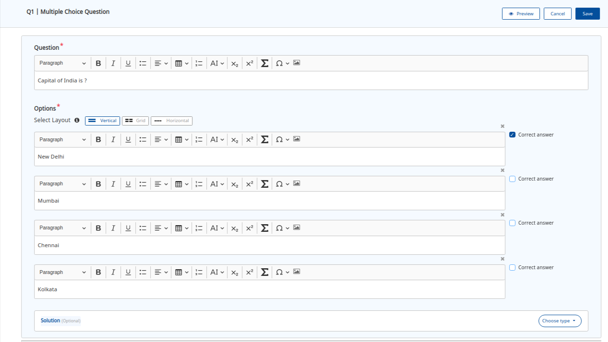

# Components

In this section, we will cover in a little detail about each of the key components of the inQuiry building block.

### **a) Question Set Editor**

Question set editor is a tool offered by inQuiry to help you kickstart your creation of **Question Banks**. The key capabilities of this editor are:

* Extendible, Embeddable and Configurable:
  * Configuration driven: The editor features are driven using a form and not hardcoded to the tool. This allows you to unleash different capabilities for different end-user workflows using the same editor.
  * It is built using an angular tech stack and can be installed and used in any portal built using angular. It can also be extended to build native integrations with JS and React frameworks.
  * It is built using a plug-in architecture thereby enabling ease of extending the code to build new capabilities.
* Create new questions or reuse already live questions to stitch a question set with proper metadata tagging.
* Ability to create question sets with multiple sections.
* Ability to define the consumption behaviour of the question set. For example:- show hints, solution, set timer, etc.
* Ability to preview question set to replicate the actual user experience before publishing it.
* In-built curation workflows to ensure that all questions are reviewed before they are made Live.

### **b) Question Editor**

Question editor enables you to create **diverse question types:**

* The inQuiry comes with two pre-built question types:
  * **Multiple choice questions** which are \*\*\*\* interactive type of question(s).

* **Subjective questions** which are non-interactive type of question(s) with pre-populated question & answers.

* Allows you to create questions with rich media, scientific formulae, math equations amongst others with proper metadata tagging.

 (1).png>)

### .png>)

### **c) Question & Question Set services**

It enables the **** question(s) and question set(s) **publishing process**. These are microservices that allow you to: \*\*\*\*

* Create, copy, collaborate, curate & publish question(s) and question set(s).
* Easily scale as per your needs.

### **d) Question Set Player (QuML player)**

Question set player is a player provided by inQuiry to create **engaging & inclusive experiences** for end users consuming the question sets. The key capabilities of this player are:

* Extendible, Embeddable, and Configurable:
  * It is built using plug-in based architecture thereby enabling you to extend and build new capabilities with ease.
  * Configuration driven: This allows you to configure the player with different capabilities for different workflows.
  * It can be plugged into any hybrid mobile app or can be played in web view. Can be extended to build native integrations with JS and React frameworks.
* Inclusive:
  * Built as per the WCAG AA recommendations allowing you to reach a wider audience from day 1.
* Offline & Online:
  * Built to support both online and offline modes of consumption.
* Enables a variety of solutions:
  * Allows you to use question sets for different use cases. For example:- the user experience for practice worksheets can be configured to show feedback, hints for each question. However, a high stake assessment can be configured to have a completely different consumption behaviour with randomization of questions, a limited number of attempts, and a completion timer.
*   Responsive to different resolutions and orientations.

    ***
