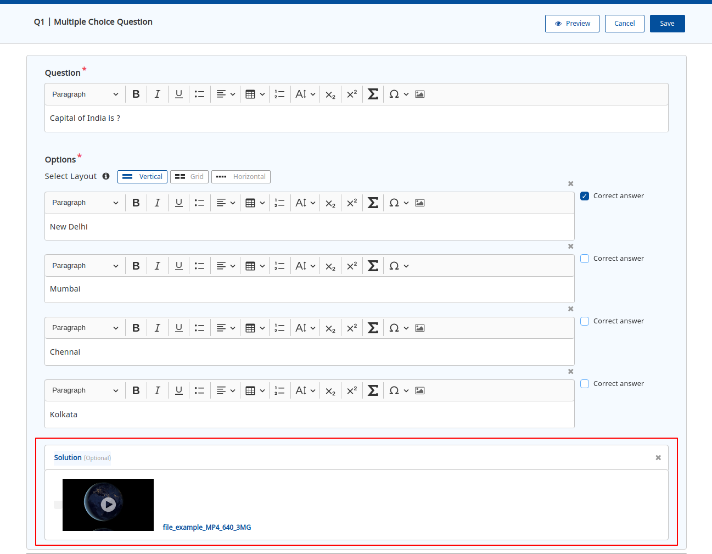
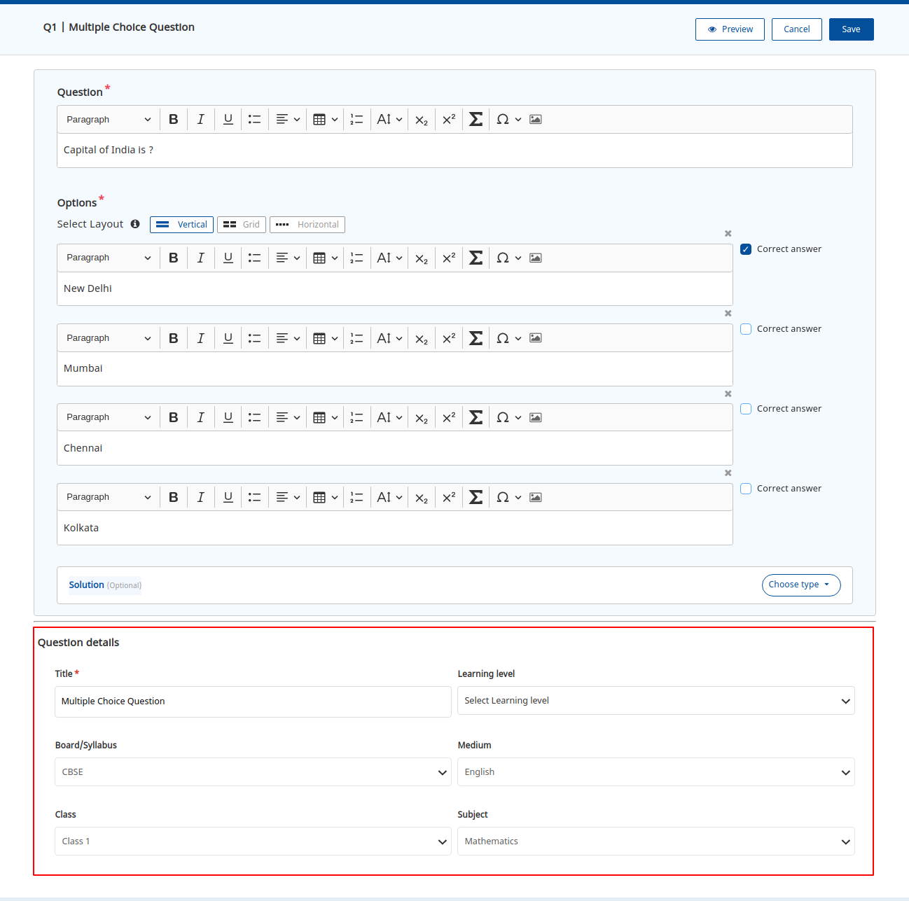
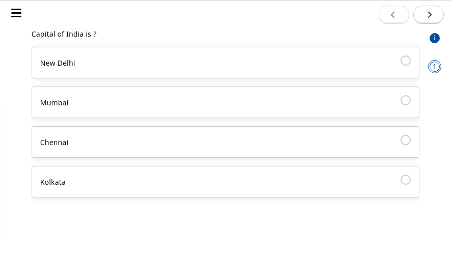
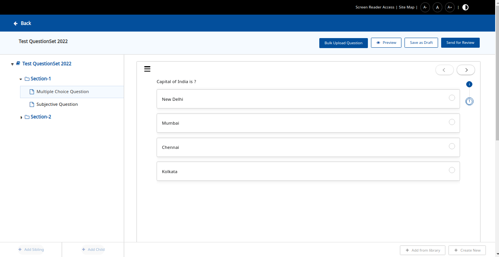
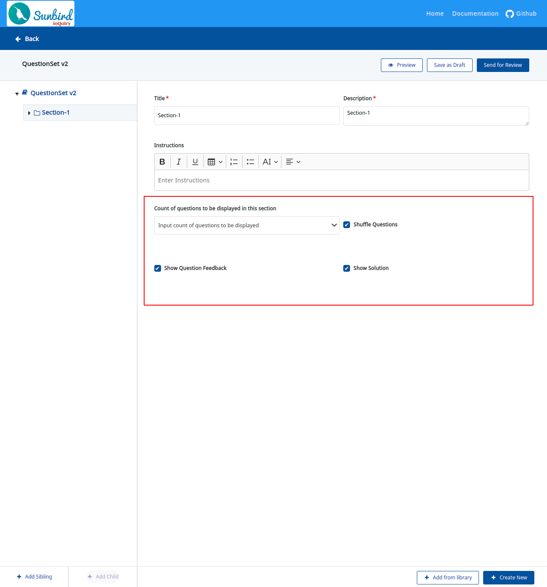

# Question & Question Set Editor

## Key Features:

Question set editor is a powerful tool that provides various features:-

#### a) Ability to load dynamic reactive forms with configuration fields and validations.

#### b) Enables the creation of different types of questions.

The inQuiry comes with two pre-built question types:

* Multiple Choice Question (interactive) and
* Subjective Question (non-interactive).

 (1) (2).png>)

#### c) Ability to create a question(s) that have images & rich text.

Question set editor provides features to add images, mathematical formula, formatting of texts as per the needs, etc.

.png>)

#### d) Ability to add and customize scientific and mathematical formulae in the question text.

.png>)

#### e) Flexibility for creators to choose to render their questions in one of the three different layouts:&#x20;

* &#x20;Vertical layout

 (1).png>)

* Grid layout

.png>)

* &#x20;Horizontal layout

 (1).png>)

#### f) Ability to include 'Solutions' - either 'text+image' only solutions or 'video' solutions to the question(s)

During the question creation solution can be added to the question, the solution can have text and image or the video which can be shown in the player on enabling the **Show Solution** in the editor.

 (1).png>)

#### g) Allows for question level metadata tagging against system defined taxonomy. Below is a screenshot of question tagging enabled using the Indian K-12 taxonomy.

#### h) Ability to preview questions

#### i) Ability to create question sets with ease using the tree structure

The WYSIWYG editor makes the creation experience easier and faster for creators. For acheving this we are using [fancy tree](https://github.com/mar10/fancytree/wiki),  which provides efficient and performance handling of large data sets, It also provides the ability to drag and drop any question in a multi-level hierarchy.

#### j) Configuration behaviour of the question set and section

The various question set level configurations available to the creator are:

1. **Set maximum time** - The maximum time allowed for the users to complete the question set.
2. **Submit confirmation page** - If enabled, provides an explicit Submit option for the users to review their answers and submit the assessment.&#x20;
3. **Max attempts** - It defines the number of times the user can attempt a question set.
4. **Summary Type** - Defines the details which we want to show on the summary page, For example:- Score, Duration, Score+Duration.&#x20;

.png>)

#### k) Ability to group questions into multiple sections with each section having its own specific behaviour.

The various section level configurations available to the creator are:

1. **Count of questions to be displayed in this section** - By default, all questions in the section are shown to the user. However, creators have an option to show only a sub-set of questions by using this property.
2. **Shuffle questions** - If enabled, users are presented with questions in a random order whenever they attempt the assessment.
3. **Show feedback** - If enabled, users are informed whether they have correctly answered questions or not.&#x20;
4. **Show solution** - If enabled, solutions to each question are shown to the users.

