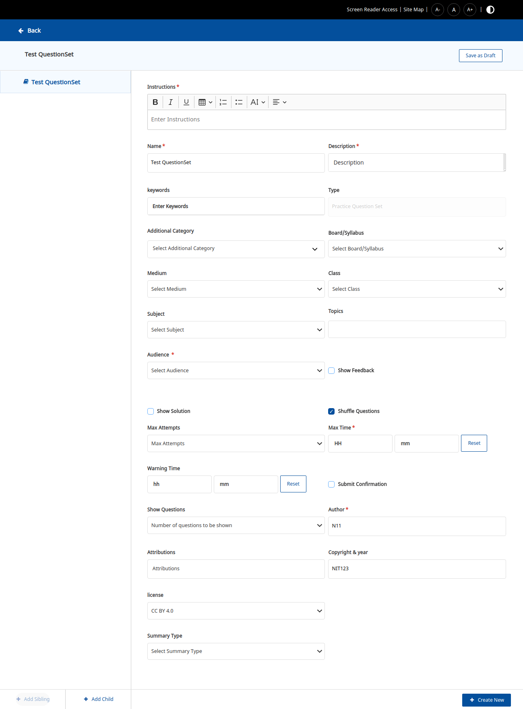

# Sample Form Configuration

## &#x20;Field Configuration Properties:

```
{
    "code": string, // property to match the backend schema ("name", "description", etc...)
    "name": string, // name of the field ("Name", "Board", "Medium", "License", "Copyright Year", etc)
    "label": string, // title of the field 
    "placeholder": string, // placeholder text to appear within the field
    "description": string, // to specify description about the field and to show as tooltip
    "default": string, // specify default value
    "dataType": string, // to specify the datatype of the field outcome ("list", "number", "text")
    "inputType": string, // to map the field type and the component ("text", "textarea", "select", "nestedselect", etc)
    "editable": boolean, // to enable or disable the field
    "required": boolean, // to specify if the field is mandatory or not (currently, not used.)
    "visible": boolean, // to hide or show the field 
    "depends": array, // array of "code" to specify that this field is dependant on other fields
    "range": array, // Array or array of objects of inputs to fields such as "select", "nestedselect", "multiselect"
    "options": array/function/map, // to specify the inputs to fields such as "select", "nestedselect", "multiselect", "framework", "frameworkCategorySelect"
    "renderingHints": json, // to specify any additional configuration ex:({"class": "sb-g-col-lg-1 required"})
    "validations": array // Array of objects to specity the validations of a field. Each validation object takes properties such as "type", "message", "value", "criteria"
    "output": string, // this field is specific to framework terms and it's associations. The field will decide the property for the field outcome ex:("name", "label", "identifier")
    "sourceCategory": string, // this field is specific to framework categories to map the category and association ex: (to map "subjectIds" with "subject" or to map "targetMediumIds" with "medium")
    "terms": array, // Array or array of object of inputs to fields related to framework and it's categories
}
```

## How to configure different types of fields

In QuestionSet Editor these are the following of fields which we are using:

### **Text**

```
{
    "code": "name",
    "dataType": "text",
    "description": "Name of the Practice Question Set", // tooltip message
    "editable": true,
    "inputType": "text",
    "label": "Name",
    "name": "Name",
    "placeholder": "Enter name of the question set",
    "renderingHints": {
        "class": "sb-g-col-lg-1 required"// this defines field to take space of 1 comun and add * in the Label of field
    },
    "required": true,
    "visible": true,
    "validations": [
        {
            "type": "maxLength",
            "value": "120",
            "message": "Input is Exceeded" // this defines the max length of fields
        },
        {
            "type": "required",
            "message": "Name is required" // this adds the required validation
        }
    ]
}
```


### **Textarea**

```
{
    "code": "description",
    "dataType": "text",
    "description": "Description of the content",
    "editable": true,
    "inputType": "textarea",
    "label": "Description",
    "name": "Description",
    "placeholder": "Description",
    "renderingHints": {
        "class": "sb-g-col-lg-1 required"
    },
    "required": true,
    "visible": true,
    "validations": [
        {
            "type": "required",
            "message": "description is required" // this adds the required validation
        }
    ]
}
```


### **Richtext**

```
{
    "code": "instructions",
    "dataType": "text",
    "description": "Instructions for the question set",
    "editable": true,
    "inputType": "richtext",
    "label": "Instructions",
    "name": "Instruction",
    "placeholder": "Enter Instructions",
    "renderingHints": {
        "class": "sb-g-col-lg-2 required"
    },
    "validations": [
        {
            "type": "required",
            "message": "Instruction is required"
        }
    ],
    "required": true,
    "visible": true
}
```

.png>)

### **Keywords**

```
{
    "code": "keywords",
    "visible": true,
    "editable": true,
    "dataType": "list",
    "name": "Keywords",
    "renderingHints": {
        "class": "sb-g-col-lg-1"
    },
    "description": "Keywords for the content",
    "inputType": "keywords",
    "label": "keywords",
    "placeholder": "Enter Keywords",
    "required": false,
    "validations": [] // when no validation is required on field
}
```


### Multi Select

```
{
    "code": "additionalCategories",
    "dataType": "list",
    "description": "Additonal Category of the Content",
    "editable": true,
    "inputType": "nestedselect",
    "label": "Additional Category",
    "name": "Additional Category",
    "placeholder": "Select Additional Category",
    "renderingHints": {
        "class": "sb-g-col-lg-1"
    },
    "default": "",
    "required": false,
    "visible": true
}
```


### **Single Select**

```
{
    "code": "board",
    "default": "",
    "visible": true,
    "depends": [],
    "editable": true,
    "dataType": "text",
    "renderingHints": {
        "class": "sb-g-col-lg-1"
    },
    "description": "Board",
    "label": "Board/Syllabus",
    "required": false,
    "name": "Board/Syllabus",
    "inputType": "select",
    "placeholder": "Select Board/Syllabus"
}
```


### **Topic Selector**

```
{
    "code": "topic",
    "visible": true,
    "editable": true,
    "dataType": "list",
    "depends": [
        "board",
        "medium",
        "gradeLevel",
        "subject"
    ],
    "default": "",
    "renderingHints": {
        "class": "sb-g-col-lg-1"
    },
    "name": "Topic",
    "description": "Choose a Topics",
    "inputType": "topicselector",
    "label": "Topics",
    "placeholder": "Choose Topics",
    "required": false
}
```


### **Checkbox**

```
{
    "code": "showSolutions",
    "dataType": "text",
    "description": "Show Solution",
    "editable": true,
    "inputType": "checkbox",
    "label": "Show Solution",
    "name": "Show Solution",
    "placeholder": "Show Solution",
    "renderingHints": {
        "class": "sb-g-col-lg-1"
    },
    "required": false,
    "visible": true
}
```


**Timer**

```
{
    "code": "maxTime",
    "visible": true,
    "editable": true,
    "dataType": "text",
    "name": "MaxTimer",
    "renderingHints": {
        "class": "sb-g-col-lg-1 required"
    },
    "description": "MaxTime for the content",
    "inputType": "timer",
    "label": "Max Time",
    "placeholder": "HH:mm:ss",
    "required": true,
    "validations": [
        {
            "type": "required", // for adding required validation
            "message": "Maxtime is required"
        },
        {
            "type": "maxTime", // for adding maxTime validation, its only applicable for timer fields
            "value": "05:30",
            "message": "Maxtime should be less than or equal to 05:30"
        },
        {
            "type": "minTime", for adding minTime validation, its only applicable for timer field
            "value": "00:01",
            "message": "Maxtime should be greater than 00:00"
        }
    ]
}
```


## How to define the width of fields and add asterisks(<mark style="color:red;">\*</mark>) on field label <a href="#root-node-form" id="root-node-form"></a>

**renderHints** is the property defines whether the fields should take space of two column or one column and to add asterisks(<mark style="color:red;">\*</mark>) in the label of field to make it look required field

* Two column space fields should have renderHints as:

```
"renderingHints": {
                        "class": "sb-g-col-lg-2"
                   }
```


* One column space fields should have renderHints as:

```
"renderingHints": {
                        "class": "sb-g-col-lg-1"
                   }
```


* For adding asterisks in the Label of field

```
"renderingHints": {
                        "class": "required"
                   }
```

Note:  sb-g-col-lg-1 or sb-g-col-lg-2 can be used with combination of required as:

```
"renderingHints": {
                        "class": "sb-g-col-lg-1 required"
                    }
```

or

```
"renderingHints": {
                        "class": "sb-g-col-lg-2 required"
                    }
```

## How to add validations on fields <a href="#root-node-form" id="root-node-form"></a>

Validation property defines the different types of validations which can be done on fields

We are using required, maxLength,compare

* **required**: for making the field to be required you need to add the required validations as:

```
"validations": [
    {
        "type": "required",
        "message": "Any message to be shown below the field if field is not filled"
    }
  ]
```

* **maxLength:** for adding restriction of length on field text, textarea, richtext.

```
  "validations": [
    {
        "type": "maxLength",
        "value": "120",
        "message": "Input is Exceeded"
    }
]
```

* **compare:** for comparing one field with another.

In the case of timer warningTime should be less than or equal to maxTime so in warning time we can add the compare validation as:

```
"validations": [
    {
        "type": "compare",
        "criteria": {
            "<=": [
                "maxTime"
            ]
        },
        "message": "warning time should be less than max timer"
    }
]
```

## Sample QuestionSet form <a href="#root-node-form" id="root-node-form"></a>



## **Sample Section Form**


## Sample Publish Check List <a href="#publish-check-list" id="publish-check-list"></a>


