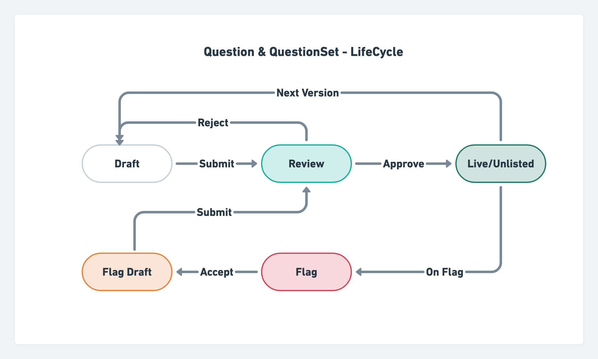

# Features


Question & QuestionSet service is a micro-service which provides APIs to manage the lifecycle and workflows of creation and consumption of Question & QuestionSet Asset.

**Offline Consumption**

The Service enables offline consumption via generation of ECAR files in the packaging stage of the publish lifecycle. Assets can be download from _**downloadUrl**_. Two _**variants**_ of the ECAR are available for each Asset. i.e. FULL and SPINE. ECAR can be downloaded and extracted in client (mobile and desktop) to play offline.

```
"downloadUrl": "<full ecar url>",
"variants": {
    "full": {
        "ecarUrl": "<full ecar url>",
        "size": "<size in byte>"
    },
    "spine": {
        "ecarUrl": "<spine ecar url>",
        "size": "<size in byte>"
    },
}
```

**Online** **Consumption**

The Service enables online consumption via Question Read and List API's. Question List API provides all required data for multiple Question which player can directly render.

**Auto Review & Publish**

The Service offers QuestionSet Review API, which move all children question to Review stage automatically irrespective of children visibility (Parent/Default), if the creator of both Root QuestionSet and its children is same.

Similarly, the service offers QuestionSet Publish API, which publish its children automatically if children qualifies for auto publish. \
\
**Publish control**

Question & QuestionSet Asset publishing can be done in two ways: Public (status: Live) and Private (status: Unlisted). When the Asset status is _**Live**,_ it  is available for consumption publicly. When the Asset status is _**Unlisted**,_ it can be accessed only by direct content link (deep link).&#x20;

**Question & QuestionSet Life Cycle**

Below diagram illustrate the status and actions during the life cycle of Question & QuestionSet Asset



For More Information on Question & QuestionSet Life Cycle, Please check [here](./#features)
