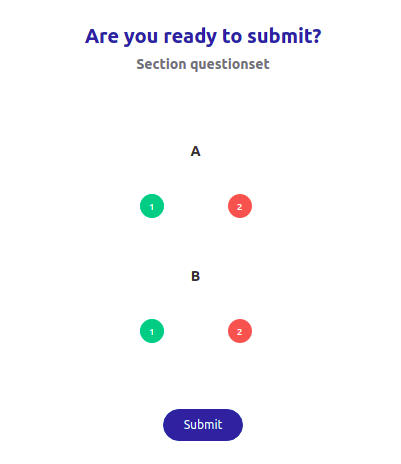

# FAQ's

### Which type of questions QuML Player supports?

As of now, the QuML player supports two types of questions viz. MCQ i.e. Multiple Choice Questions and SA i.e. Subjective Answer

### How to hide the sidebar?

By default the sidebar is visible. To hide or disable it, the user needs to pass the following config to the player :point\_down:

```typescript
"config": {
        "sideMenu": {
            "enable": true
        }
    }
```

### How to add a new menu item in the menubar?

As of now, there are 3 options are available such as share, download, and exit.\
\
Share is to share the content as a link, the download will download the content on the device and exit will close the player(prefer to use in the mobile app)\
\
To show these options in the menubar add the following config in the input of the player :point\_down:

```typescript
"config": {
      "sideMenu": {
            "enable": true,
            "showShare": true,
            "showDownload": true,
            "showExit": true,
        }
}
```


### How to enable maximum attempts allowed?

The QuML player expects two config properties in metadata to enable the maximum attempts allowed viz. <mark style="color:red;">maxAttempt</mark> and <mark style="color:red;">currentAttempt</mark>\


maxAttempt is total maximum attempt allowed\
currentAttempt is a count of the current attempt number.

\
Users can pass the config like below :point\_down:

```typescript
"metadata": {
  "maxAttempt": 3,
  "currentAttempt": 1,
}
```

### **How to enable the maximum timer and warning timer for the question set player?**

The maximum timer is the total time given to complete the assessment whereas the warning time is the time which will start blinking so that the user can get to know that the maximum time is about to be over.&#x20;

The QuML player accepts 2 config options to enable these timers. All are in milliseconds.\


```typescript
"metadata": {
  "showTimer": "No",
  "timeLimits": '{"maxTime":"1800","warningTime":"600"}',
}
```

### What is feedback and how to enable it?

Feedback is a way to tell a user that an attempted question is correct or wrong. It will show a popup for each correct and wrong answer. It even allows trying again the same question if the answer is wrong. Feedback will also update the colors in the progress bar as well.&#x20;

To enable this feature, the player accepts the following configs :point\_down:

```typescript
"metadata": {
  "showFeedback": "Yescode"
}
```

<div align="center">


</div>

### How to show solutions?

The QuML player has a feature to show solutions. Once the user attempted any question, the answer button will be shown.&#x20;

To enable the show solution, the player accepts the following configs :point\_down:

```typescript
"metadata": {
  "showSolutions": "Yes"
}
```

### How to enable the question shuffle?

Shuffling questions are works on section level. To enable the shuffle player accepts the following configs :point\_down:

```typescript
"metadata": {
  "shuffle": true,
}
```

### How to restrict the user to skip the question?

The QuML player has a provision to disallow a user from skipping the question. The player accepts the following config to disallow question skip :point\_down:

```typescript
"metadata": {
  "allowSkip": "Yes",
}
```

###

### What is submit page and how to enable it?

_<mark style="color:red;">Submit page</mark>_ provides an option to users to review their attempt details and submit the assessment. To enable the submit page one needs to pass the following config in the metadata :point\_down:

```typescript
"metadata": {
    "requiresSubmit": "Yes"
}
```

<div align="left">



</div>

### How to handle telemetry events?

The QuML library exports the <mark style="color:red;">telemetryEvent.</mark> It will provide all the generated telemetry events within the player. The user needs to listen for this event and sync with the server.

### Does the QuML player store the state of the question set?

The QuML player does not store the state of the question set, but instead, it exports the state values so that the client application can save and send it to the player for subsequent usage.


### Does the user need to be logged in to access the question set?

If the question set is part of a trackable collection or course then the user needs to log in to access the course, but a user can always access the question set without logging into the web app.

### Can users change the look and styles of the player?

As of now, the QuML player does not support any themes or custom styles. But still, users can override the existing classes and change the styles.&#x20;

**Note:** Player supports the dark and light theme, based on sb-themes


### Does the QuML player support multiple Languages?

As of now, the player works in English language. It can be extended and made multi-lingual.

