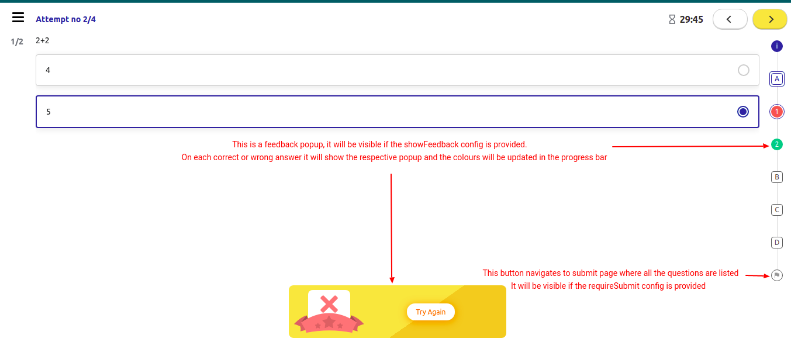

# Player Configuration


The QuML player is an angular library built with Angular version 9, and it exports some modules and components. It has a component that accepts the input from the user. The followings are the list of all the configurations on which the QuML player is working.

## ****:notebook\_with\_decorative\_cover:**Component:** _quml-main-player_&#x20;

\
&#x20; This is the main player Component that accepts some configuration (here `playerConfig`) based on it will render the player.  \
&#x20; While rendering the player it also emits some events such as `playerEvent` and `telemetryEvent quml-main-player`

Let's deep dive into the player input configuration:

```typescript
  export interface QumlPlayerConfig = {
    config: Config;
    context: Context;
    metadata: Metadata;
  }
```

## :clipboard:Input Config

### **1. Config** - Required

This Required property from the playerConfig provides the configuration for the player to enable/disable some functionalities.  \
Along with this it also provides the state of the content, if available.

```typescript
  export interface Config {
    traceId?: string;
    sideMenu?: {
        enable?: boolean;
        showShare?: boolean;
        showDownload?: boolean;
        showReplay?: boolean;
        showExit?: boolean;
    };
    progressBar?: any[];
    questions?: any[];
    lastQuestionId?: string;
    duration?: number;
    nextContent?: {
        name: string;
        identifer?: string;
    }
}
```

Description of the properties for the config

| Property              | Default Value | Required | Description                                                                                                     |
| --------------------- | ------------- | -------- | --------------------------------------------------------------------------------------------------------------- |
| traceId               | null          | false    | To trace the error                                                                                              |
| sideMenu.enable       | true          | false    | To show the sidebar menu / hamburger menu                                                                       |
| sideMenu.showShare    | true          | false    | To enable the share functionality in a sidebar menu                                                             |
| sideMenu.showDownload | true          | false    | To enable the Download functionality in a sidebar menu                                                          |
| sideMenu.showReplay   | true          | false    | To enable the Replay functionality in a sidebar menu                                                            |
| sideMenu.showExit     | true          | false    | To enable the exit functionality in a sidebar menu (Mostly used in mobile application to exit the player)       |
| progressBar           | \[ ]          | false    | Previous saved state for progressBar. It is state object containing question and there associate answer status. |
| questions             | \[ ]          | false    | Previous saved state for questions. Array of saved questions                                                    |
| lastQuestionId        | null          | false    | Last accessed question Identifier                                                                               |
| nextContent           | null          | false    | Data of the next content to be play like name and identifier                                                    |
| duration              | 0             | false    | Last player duration in miliseconds.                                                                            |

### **2. Context** - Required

This Required property from the playerConfig provides the context to the player mostly in terms of the telemetry.

Along with this it also provides the state of the content, if available.

```typescript
 export interface Context {
    mode: string;
    threshold?: number;
    authToken?: string;
    sid: string;
    did: string;
    uid: string;
    channel: string;
    pdata: Pdata;
    contextRollup: ContextRollup;
    tags: string[];
    cdata?: Cdata[];
    timeDiff?: number;
    objectRollup?: ObjectRollup;
    host?: string;
    endpoint?: string;
    userData?: {
        firstName: string;
        lastName: string;
    };
  }
```

Description of the properties for the config

| Property           | Required | Description                                                     |
| ------------------ | -------- | --------------------------------------------------------------- |
| mode               | true     | Mode is play for the player                                     |
| threshold          | false    | Its a Threshold number to fetch the questions with question API |
| authToken          | false    | Authentication token                                            |
| sid                | true     | session id of the requestor stamped by portal                   |
| did                | true     | uuid of the device                                              |
| channel            | true     | Channel which has produced the event                            |
| pdata              | true     | Producer of the event                                           |
| contextRollup      | true     | oontext Rollups upto level 4                                    |
| tags               | true     | Encrypted dimension tags passed by respective channels          |
| cdata              | false    | Correlation data                                                |
| timeDiff           | false    | Last player duration                                            |
| objectRollup       | false    | Object Rollup up to level 4                                     |
| host               | false    | Host URL                                                        |
| endpoint           | false    | Telemetry API endpoint                                          |
| userData.firstName | false    | User's first name                                               |
| userData.lastName  | false    | User's last name                                                |

### **3. Metadata:** Required

Following is the interface for the metadata:

```typescript
  export interface Metadata {
    instructions: Object; // May Contain default instructions
    showStartPage: boolean;
    timeLimits: Object; // Contains maxTime and warningTime in number of seconds
    navigationMode: string;
    maxScore: number;
    showTimer: string,
    name: string;
    description: string;
    allowSkip: string;
    primaryCategory: string;
    mimeType: string;
    objectType: string;
    maxAttempts: number;
    showHints: string;
    showFeedback: string;
    requiresSubmit: string;
    showSolutions: string;
    shuffle: boolean;
    [propName: string]: any;
  }
```

The followings are some of the properties related to the question set response, it will have other properties of content as well.

| Property        | Description                                                                                                                                                                                                          |
| --------------- | -------------------------------------------------------------------------------------------------------------------------------------------------------------------------------------------------------------------- |
| instructions    | These are instructions that will be placed on the first page of the question set or the section                                                                                                                      |
| showStartPage   | This config used to show or hide the start page in questionset                                                                                                                                                       |
| timeLimits      | This config used to show the maximum time to attempt the test with the warning time                                                                                                                                  |
| navigationMode  | Navigation of the questionset such as Linear, non-linear                                                                                                                                                             |
| maxScore        | Total maxscore of the questionset                                                                                                                                                                                    |
| showTimer       | To show the timer in descending order                                                                                                                                                                                |
| name            | Name of the Questionset                                                                                                                                                                                              |
| description     | Description of the questionset                                                                                                                                                                                       |
| allowSkip       | Config to tell the player if skipping the questions are allowed. If allowed then user can directly jump to any question, if cannot skip the question.                                                                |
| primaryCategory | Primary Category of the questionset e.g. Practice Question Set                                                                                                                                                       |
| mimeType        | MimeType of the questionset which is 'application/vnd.sunbird.questionset'                                                                                                                                           |
| maxAttempts     | Maximum number of attempts one can take. It will be shown on the player. Once the all the attempts are exhausted user cannot attempt questionset anymore                                                             |
| showHints       | Config to show/hide the hint button. By clicking on this button it will show solution page.                                                                                                                          |
| showFeedback    | Config to show/hide feedback page. If enabled it will show feedback popup for correct and wrong answer. For wrong answer user can attempt question again by clicking on ‘Try Again’ button                           |
| requiresSubmit  | Config to show/hide the submit button. This is to show submit page where all the questions are listed and user can navigate to skipped or attempted questions directly from this page before submitting the answers. |
| showSolutions   | Config to show/hide the solution button                                                                                                                                                                              |
| shuffle         | Config to enable/disable the shuffle in questions                                                                                                                                                                    |


## :arrow\_forward:Screenshots:

* Refer to the following screenshots for more understanding:




