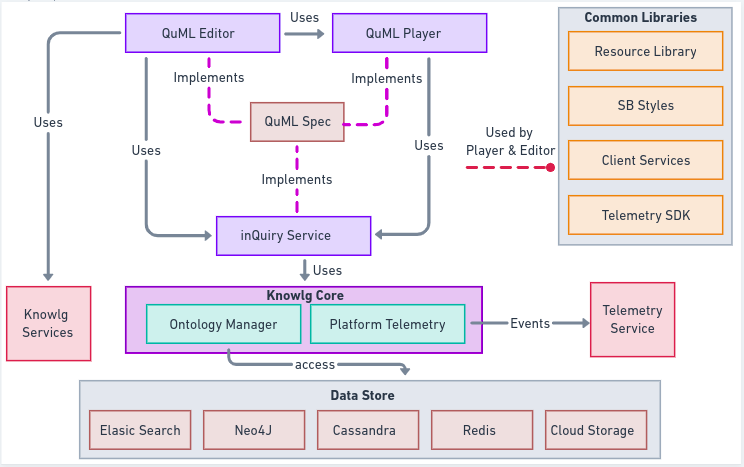

# Quick Starter Guide

This is a quick guide page to explore on the capabilities of inQuiry.&#x20;

The following section explains about the components of inQuiry on a high level and references to the respective areas of this microsite.

InQuiry has 3 components as stated below,

* Question & Question Set Editor (QuML Editor)
* Question Set Player (QuML Player)
* Question & Question Set Service (Micro-service)

The specification that enables all these 3 components work in tandem is a standard called [QuML](https://quml.sunbird.org/) (Question Markup Language)

## inQuiry components

The section below gives a high level overview of how the inQuiry components functions together. More details [here](../technical-architecture.md).

<figure><figcaption></figcaption></figure>

## What is QuML?

QuML defines a standard format for representation of questions, tests and their results, supporting the exchange of this material between authoring and delivery systems, repositories and other e-learning systems.

More details on QuML is available [here](https://quml.sunbird.org/).

QuML is a specification for storage, rendering and distribution of Questions and QuestionSets.

Key advantages are,

* Interoperability
* Longevity
* Reusability

## Question & Question Set Editor (QuML Editor)

Question set editor is a tool offered by inQuiry to help you kickstart your creation of Question Banks.

More details on the editor can be found [here](../capabilities-1.md#a-question-set-editor) and [here](../product-and-developer-guide/question-and-question-set-editor/).

Editor architecture is as below,

<figure><figcaption></figcaption></figure>

Editor Module is as detailed below,

<figure><figcaption></figcaption></figure>

Additional details about the internals of the Editor

* Editor Module - Root module of the editor library where all the components and services are imported
* Editor Component - Base component of the Editor which consists of the sub components
  * Header Components - contains the buttons any header elements
  * Metadata Components - for capturing metadata
  * Player Component - for preview of question and questionSet
  * Fancy Tree Component - for tree view (navigation)
  * Resource Lib Component - for adding question from Library
* Editor Service - service layer that makes the API calls related to Editor. For eg:- save, update
* Telemetry Service - initialise the Telemetry SDK and prepare the telemetry events
  * Telemetry SDK - to sent out the telemetry events to external Telemetry Service

## Question Set Player (QuML Player)

Question set player is a player provided by inQuiry to create engaging & inclusive experiences for end users consuming the question sets.

More details on the player can be found [here](../capabilities-1.md#d-question-set-player-quml-player) and [here](../product-and-developer-guide/question-set-player/).

Player architecture is as below,

<figure><figcaption></figcaption></figure>

Player Module is as detailed below,

<figure><figcaption></figcaption></figure>

Additional details about the internals of the Player

* Player Module - Root module of the player library where all the components and services are imported
* Player Component - Base component of the Editor which consists of the sub components
  * Section Component - Handles different types of questions by using its sub components
    * Start Page Component - Provide instructions for exams
    * MCQ Component - for rendering multiple choice questions.
    * SA Component - for rendering short answer questions (subjective)
    * Alert Component - Showing feedback or solutions
  * End Page Component - Summary of exam
* Viewer Service - service layer that makes the API calls related to Player. For eg:- question list
* Telemetry Service - initialise the Telemetry SDK and prepare the telemetry events
  * Telemetry SDK - to sent out the telemetry events to external Telemetry Service

## Question & Question Set Service

Question and Question set service is a micro-service which provides APIs to manage the lifecycle and workflows of creation and consumption of question & question set objects.

More details on the player can be found [here](../capabilities-1.md#c-question-and-question-set-services) and [here](../product-and-developer-guide/question-and-question-set-service/).

Question & Question Set Service architecture is as below,

<figure><figcaption></figcaption></figure>

## Different types of questions supported

As part of the standard offering, inQuiry supports the below questions out of the box

* Multiple Choice Question
* Multi-select Multiple Choice Question
* Subjective Question

The service layer is capable for creating a variety of different question types adhering to the QuML specification.&#x20;

Examples of adopter implementation of question types are as follow,

* Fill In The Blanks
* Date
* Slider
* etc.

## Technology stack used in inQuiry Components

Editor is build using: Angular / HTML5 / CSS

Player is build using: Angular / HTML5 / CSS

Service is build using: Play Framework / Scala
