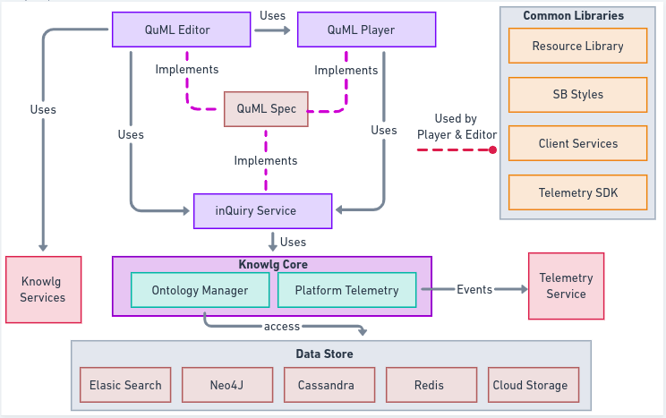

# inQuiry Components

This section captures information on the internal details about the inQuiry Service component.

### Component Architecture Diagram

<figure><figcaption></figcaption></figure>

Component Architecture Explained

* The core components of inQuiry are QuML Editor, QuML player and inQuiry Service.
* QuML Editor, Player and inQuiry Service all implements the QuML specification for creating and maintaining Questions and QuestionSets.
* QuML Editor uses the Knowlg BB services as explained [here](https://app.gitbook.com/o/-Mi9QwJlsfb7xuxTBc0J/s/Wu4HIWGkb7dD4y0Kup4W/\~/changes/294/learn/product-and-developer-guide/question-and-question-set-editor/apis#knowlg-service)
* inQuiry Service also uses the Knowlg core services for inprocess communication to the underlying data stores.
* inQuiry uses Telemetry services for sending the telemetry events
* There are a few common sunbird libraries that both QuML Editor and QuML player uses

### Brief Description

Sunbird inQuiry is used to power the assessment capabilities in Sunbird. This uses an open specification called as QuML for preparing the questions and question sets.

#### Components

* [Editor](https://app.gitbook.com/o/-Mi9QwJlsfb7xuxTBc0J/s/Wu4HIWGkb7dD4y0Kup4W/\~/changes/294/learn/quick-starter-guide/editor)
* [Player](https://app.gitbook.com/o/-Mi9QwJlsfb7xuxTBc0J/s/Wu4HIWGkb7dD4y0Kup4W/\~/changes/294/learn/quick-starter-guide/player)
* [inQuiry Service](https://app.gitbook.com/o/-Mi9QwJlsfb7xuxTBc0J/s/Wu4HIWGkb7dD4y0Kup4W/\~/changes/294/learn/quick-starter-guide/inquiry-service)

