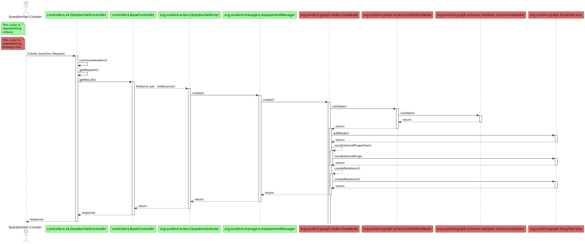
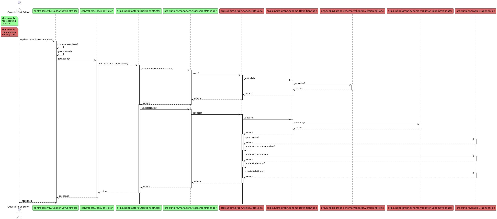
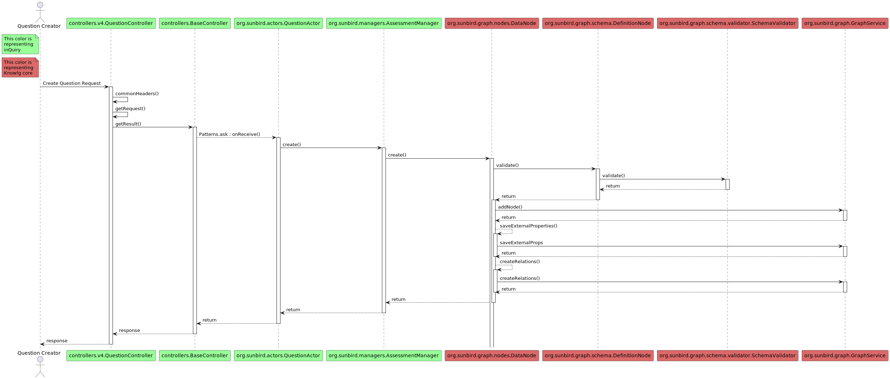

# inQuiry Service

Sunbird [inQuiry Service](https://inquiry.sunbird.org/learn/product-and-developer-guide/question-and-question-set-service) is the backend service used from inQuiry Editor and Player. This service is also called as Question & QuestionSet service.

## Question & Question Set Service

Question and Question set service is a micro-service which provides APIs to manage the lifecycle and workflows of creation and consumption of question & question set objects.

More details on the player can be found [here](../../capabilities-1.md#c-question-and-question-set-services) and [here](../../product-and-developer-guide/question-and-question-set-service/).

Question & Question Set Service architecture is as below,

<figure><figcaption></figcaption></figure>

#### Player / Editor interaction with inQuiry Service

<figure><figcaption></figcaption></figure>

#### Publish Process

<figure><figcaption><p>Publish Process</p></figcaption></figure>

### Critical APIs - Sequence of calls

Below is a high level picture of how the sequence of flow happens for some of the critical apis. The flow is similar to other API end points in inQuiry.

This also shows the usage of Knowlg core in the flow of inQuiry apis.

**QuestionSet Create**

<figure><figcaption></figcaption></figure>

**QuestionSet Read**

<figure><figcaption></figcaption></figure>

**QuestionSet Update**

<figure><figcaption></figcaption></figure>

**Question Create**

<div data-full-width="false">

<figure><figcaption></figcaption></figure>

</div>


The detail on how the data is saved and retrieved is not depicted in above sequence of flow as it is part of Knowlg core library.&#x20;


#### Data Models

* Schemas
  * [Question Schema](https://inquiry.sunbird.org/learn/product-and-developer-guide/question-and-question-set-service/schema/question-schema)
  * [QuestionSet Schema](https://inquiry.sunbird.org/learn/product-and-developer-guide/question-and-question-set-service/schema/questionset-schema)
* Databases
  * **Neo4J** (Primary Data Storage. inQuiry store all objects (e.g: Question/QuestionSet/ObjectCategory, etc) simple/lite metadata (e.g: name, description, createdOn, etc) in graph)
  * **Cassandra** (Secondary data Storage. inQuiry stores all complex/bulk data in this storage. For more information, please refer to external section of each object config (config.json) to see what all data gets stored in secondary storage for particular object.)
  * **Elastic Search** (Data Stored in Grpah Database (Primary Data Storage) gets replicated in Elasticsearch through data pipeline. So that user can search data based on different criteria (e.g: need to search science subject questions for class 5))
  * **Redis** (Used for caching the question / questionSet information. It only stores object which are ready for consumption (objects in Live status))
  * **Cloud Storage** (Used to store assets like media, question/questionset bundles, artifacts in the cloud storage)

#### Code Structure

* [Repository](https://inquiry.sunbird.org/learn/product-and-developer-guide/question-and-question-set-service/source-code)
*   Important Folder / Package structure

    ```
    - assessment-api [API service containing question and question set service]
     - assessment-actors
       - src/main/scala/org/sunbird /actors [Contains the actor module which talk to manager module as well as graph engine]
       - src/main/scala/org/sunbird/managers [Contains additional utility which is needed for processing]
     - assessment-service
       - app/controllers [The REST API controllers]
     - qs-hierarchy-manager
       - src/main/scala/org/sunbird/managers [all utility to perform operations on hierarchal structure]
    ```
* Sub Components
  *   Question API

      This is used for question management like create, read, update, review, publish etc.

      [API Documentation](https://inquiry.sunbird.org/learn/product-and-developer-guide/question-and-question-set-service/apis/v1#question-management-apis)
  *   QuestionSet API

      This is used for question set management like create, read, update, review, publish etc.

      [API Documentation](https://inquiry.sunbird.org/learn/product-and-developer-guide/question-and-question-set-service/apis/v1#question-set-management-apis)
  *   Flink Jobs Used

      async-questionset-publish \[Used for Question and QuestionSet publish]
  * [Configuration](https://inquiry.sunbird.org/use/developer-installation/question-and-question-set-service/configuration#questionset-republish-flink-job)

#### Dependencies

Details are listed [here](https://inquiry.sunbird.org/use/learn-more/dependencies) for the below specified dependencies

* [Sunbird QuML Specification](https://quml.sunbird.org/)
* [Sunbird Knowlg Service](https://knowlg.sunbird.org/)
* Sunbird Telemetry Specification
* Sunbird Obsrv (Optional)

## API listing

The APIs exposed by the micro service is available [here](../../product-and-developer-guide/question-and-question-set-service/apis/)
