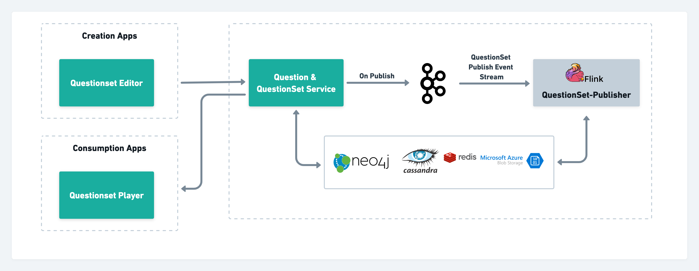

# Technical Architecture

Sunbird inQuiry building block enables the creation and consumption of the Question & Question set objects.&#x20;

The creation apps calls Question& Question Set service to create, update & publish the Question & Question Sets and consumption apps use the same service for rendering Question Sets.

