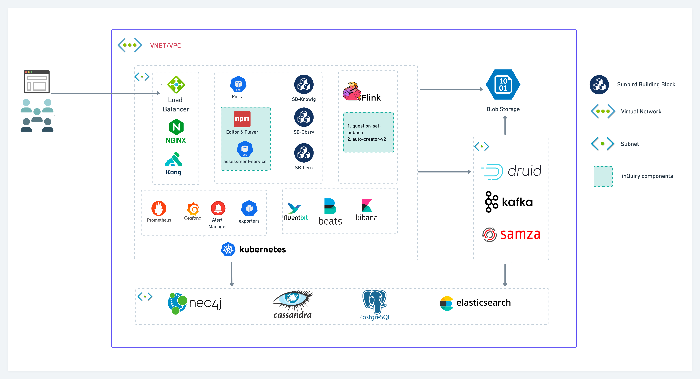

# Overview

There are two options to deploy Sunbird inQuiry:

**Option 1: Independently deploy Sunbird inQuiry building block**

Please use the below community forums link for any quires related to deployment, and we will assist you to complete the deployment. We are currently working on documentation for deploying Sunbird inQuiry independently.

[https://github.com/orgs/Sunbird-inQuiry/discussions](https://github.com/orgs/Sunbird-inQuiry/discussions)

**Option 2: Deploying Sunbird inQuiry as part of Sunbird-ED**

Please refer to the [Sunbird-Ed deployment ](https://ed.sunbird.org/use/prerequisites-for-your-own-sunbird-ed-instance)for more details.

Below, a deployment view diagram will explain how inQuiry Building block components are deployed in SunbirdEd.&#x20;

* Question & Question Set Service (assessment-service):
  * The service holds Question & QuestionSet APIs.
* Question Set Editor & Player:&#x20;
  * InQuiry BB provides both editor & player as  NPM packages. SunbirdEd portal package those as libraries and provides both creation and consumption experience.
* Flink Jobs:
  * InQuiry BB has below two asynchronous jobs&#x20;
    * questionset-publish:
      * This job is used for question/question set Enrichment. It performs all necessary enrichment to the question/ question set required for Consumption.
    * Auto-crerator-v2:
      * This job is used during the movement of a question/ question set from one instance to another (import QuestionSet)

